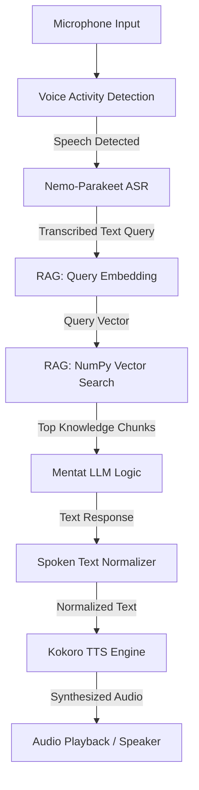

## 1. Description

The **Dune Mentat Voice Assistant** is an offline-first, low-latency voice assistant configured to respond entirely in English, simulating the personality of a **Mentat**—a highly logical, computational biological human from Frank Herbert's *Dune* universe.

The system combines highly optimized local machine learning models (using ONNX Runtime) with a **lightweight RAG pipeline** to provide the assistant with deep knowledge of the Dune universe without overloading CPU or RAM:
*   **VAD (Voice Activity Detection)**: Filters ambient noise and detects user speech boundaries.
*   **ASR (Automatic Speech Recognition)**: Transcribes the user's spoken English into text.
*   **Lightweight RAG Engine**: Performs semantic search on Dune wiki files using a simple, dependency-free **NumPy-based Cosine Similarity vector store** (optimized for speed and portability on Raspberry Pi).
*   **LLM Engine**: Generates contextual responses fitting the logical persona of a Mentat by combining query text with retrieved context.
*   **Text Normalizer**: Converts text formatting (like symbols, percentages, decimals, and math notations) into fully pronounceable spoken words.
*   **TTS (Text-to-Speech)**: Synthesizes natural, high-quality English voice outputs.

---

## 2. Content & Pipeline Steps

The sequential execution pipeline of the system is structured as follows:

### Ingestion Phase (Offline Knowledge Setup)
Before running the assistant, the raw knowledge documents must be prepared:
1. **Document Loading**: Text files from `data/knowledge/` are read.
2. **Text Chunking**: Files are split into small, overlapping chunks (e.g., 500 characters with 100 characters overlap) to preserve local context.
3. **Embedding Generation**: Text chunks are passed to the Gemini Embedding API (`text-embedding-004`) to generate vectors. Using a cloud API keeps the Raspberry Pi lightweight by avoiding local embedding model CPU/RAM overhead.
4. **Vector Storage**: The resulting vectors and text chunks are saved into a simple, lightweight local JSON or NumPy binary file (`data/vectors.npz`), completely avoiding heavy database engines like ChromaDB or FAISS.

---

### Step 1: Voice Activity Detection (VAD) & Audio Capture
*   **Description**: Continuously listens to the device's microphone. It analyzes real-time audio segments to separate user speech from environmental noise.
*   **Input**: Raw audio buffer (PCM 16kHz, mono, float32) captured via the `sounddevice` library.
*   **Processing**: Audio chunks are fed into the **Silero VAD v5** model (`silero_vad_v5.onnx`) to compute active speech probability.
*   **Output**: Speech state triggers (Speech Started / Speech Ended).
*   **Key Files**: [vad.py](file:///d:/GIT/Mentat_voice_assistant/src/glados/ASR/vad.py)

### Step 2: Automatic Speech Recognition (ASR)
*   **Description**: Transcribes the recorded voice recording into raw text.
*   **Input**: The complete audio segment captured between VAD speech boundaries.
*   **Processing**:
    1. Computes the Mel Spectrogram from the audio waveform via [mel_spectrogram.py](file:///d:/GIT/Mentat_voice_assistant/src/glados/ASR/mel_spectrogram.py).
    2. Feeds the spectrogram into the **NVIDIA Nemo-Parakeet TDT-CTC 110M** model (`nemo-parakeet_tdt_ctc_110m.onnx`).
    3. Decodes predicted log probabilities (logits) using the vocabulary dictionary from `nemo-parakeet_tdt_ctc_110m_tokens.txt`.
*   **Output**: Transcribed English text query (e.g., *"tell me about spice"*).
*   **Key Files**: [asr.py](file:///d:/GIT/Mentat_voice_assistant/src/glados/ASR/asr.py)

### Step 3: RAG: Semantic Vector Search (Raspberry Pi Optimized)
*   **Description**: Looks up the most relevant pieces of Dune lore related to the user's query from the local knowledge base.
*   **Input**: Transcribed English text query.
*   **Processing**:
    1. Converts the user's text query into a query vector using the Gemini Embedding API.
    2. Performs a mathematical **Cosine Similarity** search between the query vector and all pre-calculated document vectors stored in `data/vectors.npz` using `numpy`. This operation takes < 1 ms on a Raspberry Pi and requires no external vector database servers or C++ compilation.
    3. Retrieves the top-K (typically 2 to 3) text chunks with the highest similarity score.
*   **Output**: Relevant text context chunks.
*   **Key Files**: `src/glados/utils/rag_store.py` (New RAG manager component)

### Step 4: Mentat LLM Engine
*   **Description**: Processes the transcribed text query combined with retrieved RAG context chunks to generate a logical, concise, and lore-accurate response under the Mentat persona.
*   **Input**: Transcribed query text, retrieved knowledge chunks, and dialogue history.
*   **Processing**: Merges the query with the context chunks into the LLM system prompt context, then calls the configured completions service (e.g., Gemini or Claude).
*   **Output**: Written text response in English.
*   **Key Files**: [engine.py](file:///d:/GIT/Mentat_voice_assistant/src/glados/engine.py), [glados_config.yaml](file:///d:/GIT/Mentat_voice_assistant/configs/glados_config.yaml)

### Step 5: Spoken Text Normalization
*   **Description**: Translates numbers, abbreviations, and math symbols into fully spelled-out spoken words so the TTS engine can pronounce them correctly.
*   **Input**: Raw written response text from the LLM.
*   **Processing**: Regular expression rules clean and substitute specific patterns:
    *   Percentages: `"50%"` -> `"fifty percent"`
    *   Currencies: `"$10.50"` -> `"ten dollars and fifty cents"`
    *   Times & Years: `"3:00pm"` -> `"three p m"`, `"2024"` -> `"twenty twenty-four"`
    *   Math notation: `"8^2 = 64"` -> `"eight to the power of two equals sixty-four"`
*   **Output**: Normalized, pronunciation-ready English text.
*   **Key Files**: [spoken_text_converter.py](file:///d:/GIT/Mentat_voice_assistant/src/glados/utils/spoken_text_converter.py)

### Step 6: Text-to-Speech (TTS) & Audio Playback
*   **Description**: Converts the normalized text into audio waveform and outputs it via the speakers.
*   **Input**: Normalized pronunciation-ready English text.
*   **Processing**:
    1. Generates standard phonetic tokens (phonemes) using `phomenizer_en.onnx`.
    2. Runs inference on **Kokoro v1.0** (`kokoro-v1.0.fp16.onnx`) with the voice embeddings binary (`kokoro-voices-v1.0.bin`) using the `af_alloy` voice.
    3. Pipes the synthesized audio buffer (24kHz sample rate) directly to the system sound device.
*   **Output**: Auditory spoken output from the device speakers.
*   **Key Files**: [tts_kokoro.py](file:///d:/GIT/Mentat_voice_assistant/src/glados/TTS/tts_kokoro.py)
